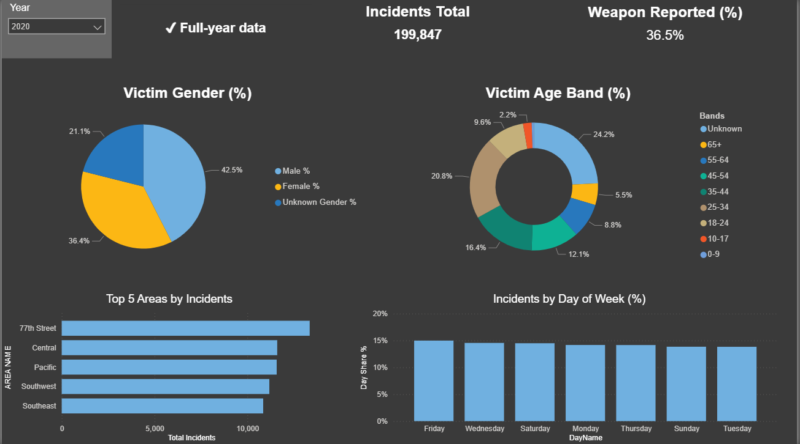
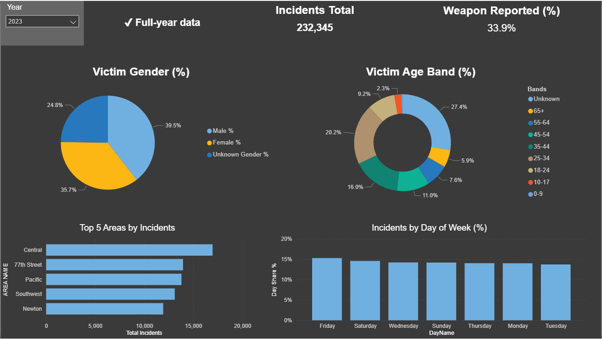
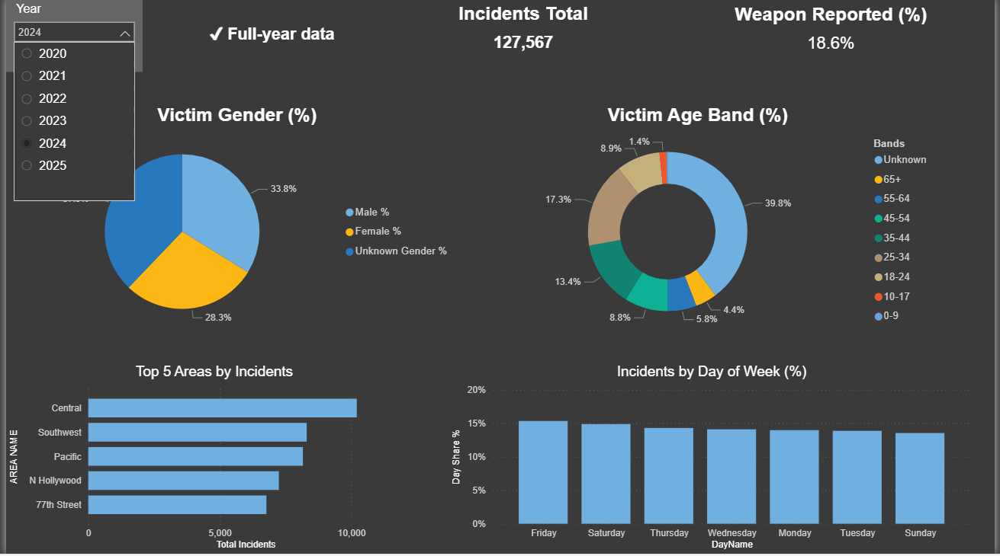

# LAPD Crime Dashboard (2020–2025) - Power BI Project

## Introduction
This project presents an interactive dashboard built to explore and visualize crime data reported by the Los Angeles Police Department (LAPD). The dashboard provides insights into crime patterns across multiple years, helping users better understand trends in public safety, law enforcement activity, and crime distribution over time.  

## Dataset Used
We used a **real, publicly available dataset**: [Crime Data from 2020 to Present – Data.gov](https://catalog.data.gov/dataset/crime-data-from-2020-to-present). The dataset contains detailed records of reported crimes in Los Angeles from 2020 onwards, including attributes such as the type of crime, date, location, and demographic information of victims.  

## Objectives
The main goals of this project are:
- To create an **accessible dashboard** for visualizing LAPD crime data.  
- To analyze **crime trends across years (2020–2025)**.  
- To allow filtering and exploration by year, providing focused insights into crime distribution.  
- To provide a **portfolio-ready data visualization project** that demonstrates skills in data cleaning, dashboarding, and presentation.  

## Dashboard Screenshots
The dashboard supports interactive exploration for **all years 2020–2025**. Below are sample screenshots from selected years:  

- **Year 2020**  
    

- **Year 2023**  
    

- **Year 2024**  
    

## Conclusion
- This dashboard provides a clear and interactive way to analyze LAPD crime data, enabling exploration of crime statistics year by year.  
- By using real-world data, the project demonstrates practical skills in **data handling, dashboard creation, and visualization storytelling**.  
- Future improvements could include predictive analytics, geographical mapping, and integration of external datasets for deeper insights.  
